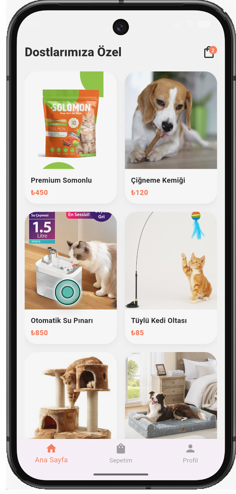
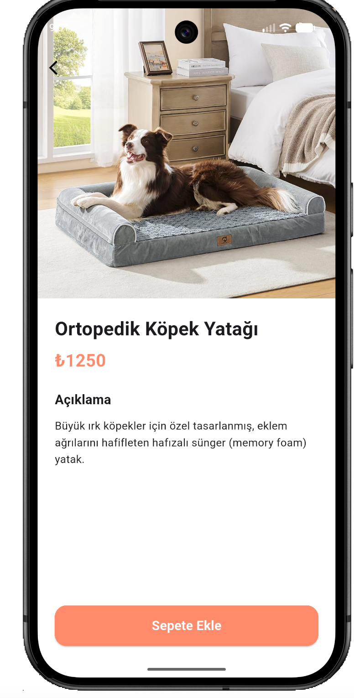
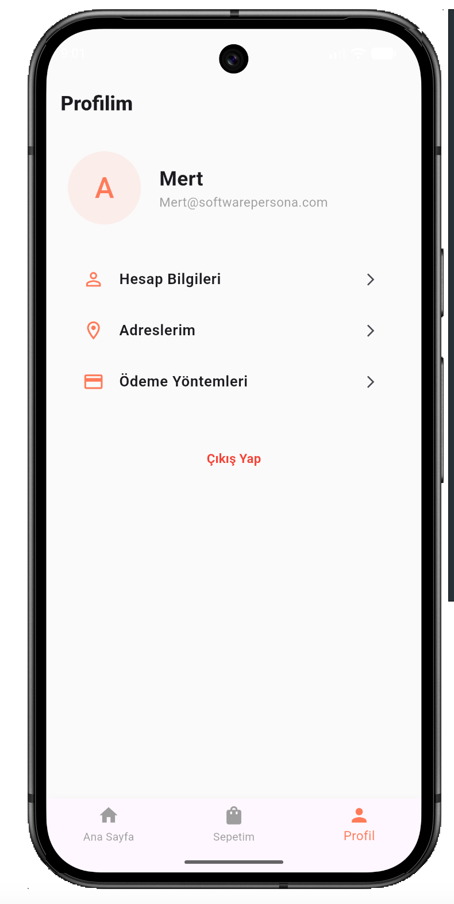

# Adım Dostu - Pet Shop Mobile App

A Flutter pet shop application featuring a user-friendly interface and dynamic data structure, developed as part of the Software Persona internship program.

## 📸 Screenshots

  
  &nbsp;&nbsp;&nbsp;
  
  &nbsp;&nbsp;&nbsp;
  

## 🚀 Features
- **Dynamic Data:** Product information is fetched asynchronously from the `assets/data/products.json` file.
- **Modern UI/UX:** Built with custom color palettes and modern components (Custom Widgets), staying true to the original Figma design.
- **Cart Management:** Product addition, removal, and total price calculation features are fully functional.
- **Bottom Navigation:** Smooth transitions between Home, Cart, and Profile tabs.

## 🛠️ Technologies Used
- **Framework:** Flutter (v3.41.9)
- **Language:** Dart (v3.11.5)
- **Data Format:** JSON (Local Asset Bundle)

## 📂 Project Structure
- `lib/models/`: Data models
- `lib/screens/`: Application screens
- `lib/widgets/`: Reusable components
- `assets/data/`: Local database (`products.json`)

---
Developed by: **Mert** - Software Persona Intern
